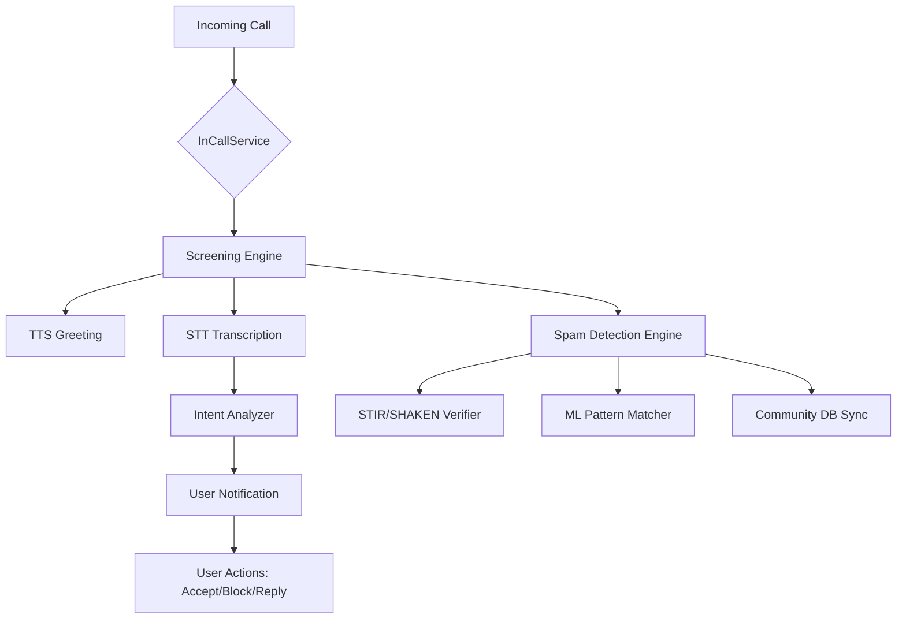

# Technical Architecture: CallGuard

This document provides a deep dive into the technical design and architectural decisions for the CallGuard application.

## 🏗️ System Overview

CallGuard is built using a service-oriented architecture that leverages core Android system APIs to intercept and manage phone calls.

---

## 📦 Core Modules

### 1. Screening Engine (`com.callguard.app.screening`)
This is the heart of the app. It uses the `InCallService` API to gain control over incoming calls.
- **InCallUIManager**: Manages the overlay UI that appears over the system dialer.
- **CallScreeningService**: Implements the logic for automatic answering and call state monitoring.

### 2. Conversation Module (`com.callguard.app.conversation`)
Handles all voice and text processing.
- **SpeechToTextProcessor**: Uses Android's `SpeechRecognizer` for offline-first transcription.
- **ResponseGenerator**: A template-based system that generates TTS responses based on detected caller intent.

### 3. Spam Intelligence (`com.callguard.app.spam`)
A multi-layered system for identifying unwanted callers.
- **StirShakenVerifier**: Parses SIP headers and carrier metadata to verify caller identity.
- **SpamDetectionEngine**: Runs heuristic checks (frequency, time of day, geographic origin).
- **CommunityDatabase**: A local Room cache of the global spam list, synced periodically via a background worker.

---

## 💾 Data Management

### Persistence Layer
We use **Room Database** for high-performance, structured data storage.
- **`CallLogEntity`**: Stores timestamp, caller ID, duration, and screening outcome.
- **`TranscriptEntity`**: Stores the full text of the screening conversation, linked to a call log entry.
- **`SpamEntity`**: Stores locally cached spam numbers and their confidence scores.

### Encryption
- **At Rest**: Call recordings and transcripts are encrypted using the Android Keystore system.
- **In Transit**: All API communication with the community database is performed over TLS 1.3.

---

## 🛠️ Key Android APIs Used

| API | Purpose |
| :--- | :--- |
| `InCallService` | Primary hook for call control and UI integration. |
| `NotificationListenerService` | Used for detecting incoming calls on older Android versions. |
| `JobScheduler` / `WorkManager` | Handles background syncing of the spam database. |
| `TextToSpeech` | Converts assistant messages to audio. |
| `SpeechRecognizer` | Converts caller audio to text transcripts. |

---

## 📈 Performance Targets

- **Detection Latency**: Spam checks must complete within **100ms** to avoid delaying the user's notification.
- **Resource Footprint**: The background service must consume less than **2%** of daily battery.
- **Binary Size**: Optimized with R8/ProGuard to keep the APK size under **15MB**.
