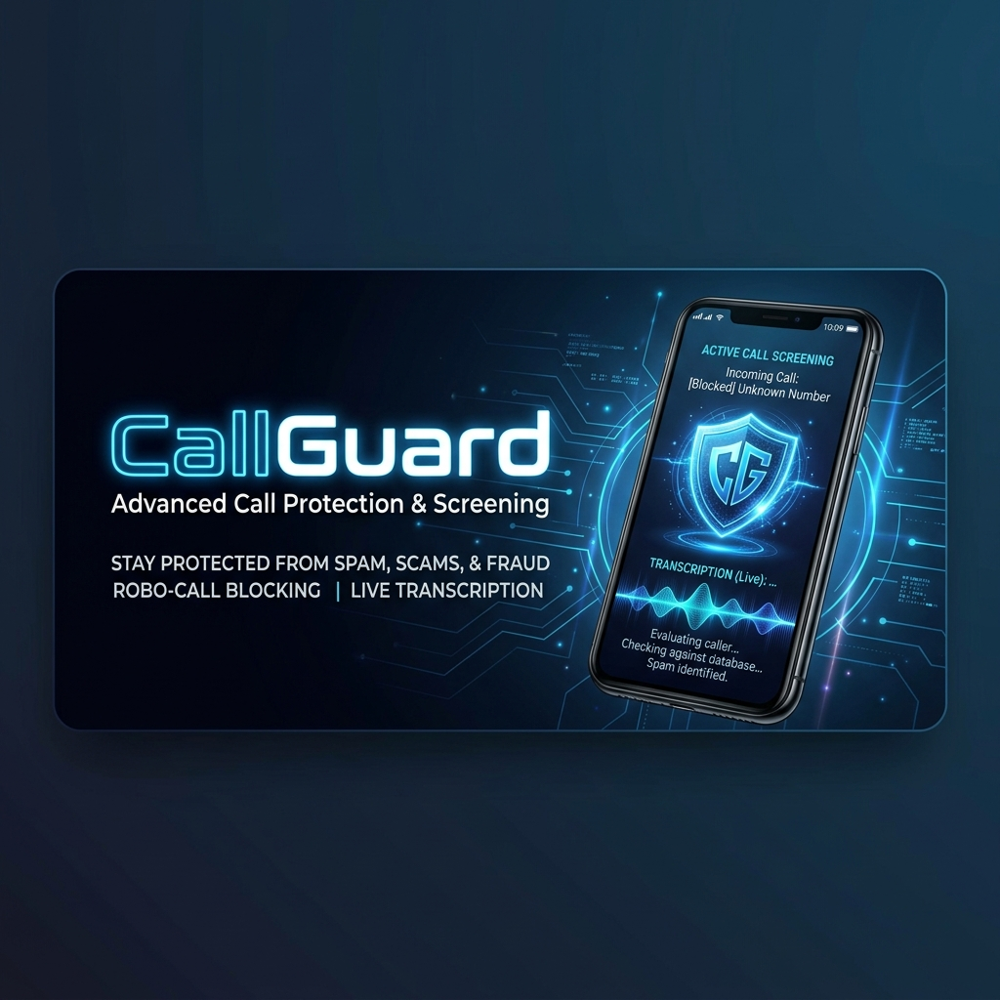
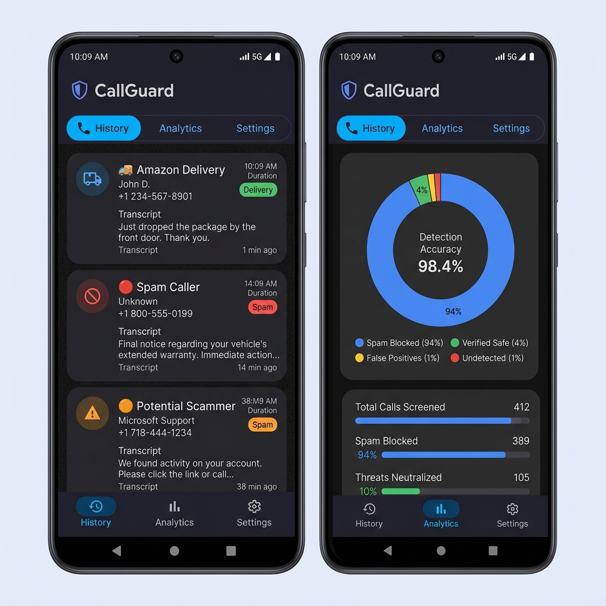

# CallGuard: Smart Call Screener 📱🛡️



<p align="center">
  <a href="https://developer.android.com"></a>
  <a href="LICENSE"></a>
  <a href="https://gradle.org"></a>
  <a href="IMPLEMENTED_FEATURES.md"></a>
</p>

---

## 🌟 Overview

**CallGuard** is a premium, privacy-first Android application designed to put you back in control of your phone. Using advanced on-device AI and real-time transcription, CallGuard intercepts unknown callers, identifies their intent, and provides you with a live conversation log before you even pick up the phone.

> **Stop spammers in their tracks. Never miss an important call again.**

---

## ✨ Key Features

### 🎙️ AI-Powered Conversation
- **Automated Assistant:** Screens unknown callers using a natural-sounding Text-to-Speech engine.
- **Real-Time Transcription:** High-accuracy Speech-to-Text conversion displayed live as the caller speaks.
- **Intent Recognition:** Automatically categorizes calls as "Delivery", "Business", "Spam", or "Urgent" using NLP.
- **Dynamic Greetings:** Context-aware greetings that change based on the time of day and caller intent.

### 🛡️ Multi-Layered Protection
- **STIR/SHAKEN Integration:** Carrier-level identity verification to prevent number spoofing.
- **Hybrid Spam Engine:** Combines local pattern recognition (ML) with customizable heuristic rules.
- **Contact Whitelisting:** Your friends and family bypass screening automatically for a seamless experience.

### 📊 Beautifully Organized
- **Bottom Navigation:** A modern 3-tab layout separating your History, Analytics, and Settings.
- **Visual Analytics:** Interactive Pie Charts visualizing your "Spam Accuracy" and "Time Saved" metrics.
- **Expandable Transcripts:** Dive deep into conversation logs with a single tap.

### 🔒 Privacy by Design
- **Local-Only Processing:** Keep your sensitive voice data on your device with an offline-first STT mode.
- **Biometric Dashboard:** Secure your call history behind fingerprint or face authentication.
- **Zero Third-Party SDKs:** We don't sell your data. No external analytics, no tracking.

---

## 📱 User Interface



---

## 📅 Project Roadmap

| Phase | Milestone | Status | Key Features |
| :--- | :--- | :--- | :--- |
| **P1** | **Core Engine** | ✅ | Call Interception, TTS Greeting, API 34 Hardening |
| **P2** | **Intelligence** | ✅ | Real-time STT, Room DB Persistence, Basic Spam Rules |
| **P3** | **Security** | ✅ | STIR/SHAKEN, Biometric Lock, Local-Only Mode |
| **P4** | **AI & Analytics** | ✅ | NLP Intent Classifier, Rich Charts, Fragment Refactor |
| **P5** | **Community** | 🚧 | Global Spam List Sync, Contextual Geofencing |

---

## 🚀 Getting Started

### Prerequisites
*   Android Studio **Ladybug** or newer
*   Android SDK **34** (Android 14)
*   A physical device or emulator running **Android 8.0+**

### Installation
1.  **Clone the Repo:**
    ```bash
    git clone https://github.com/TheCaptainCook/CallGuard-Smart-Call-Screener.git
    ```
2.  **Open in Android Studio:** Select the root directory and wait for Gradle sync.
3.  **Run & Grant Permissions:** Ensure you grant `RECORD_AUDIO` and `READ_CONTACTS` for the best experience.

---

## 🛠️ Advanced Configuration

CallGuard is designed to be flexible. In the **Settings** tab, you can:
*   **Change TTS Voices:** Select from a variety of languages and regional accents.
*   **Adjust Sensitivity:** Customize the ring delay before the assistant answers.
*   **Harden Security:** Enable the Biometric Lock and Local-Only STT flags.

---

## 🤝 Contributing

We love community involvement! Please check out [CONTRIBUTING.md](CONTRIBUTING.md) to get started.

---

## 📄 License

Distributed under the MIT License. See `LICENSE` for more information.

---

<p align="center">
  Made with ❤️ by the CallGuard Team
</p>
